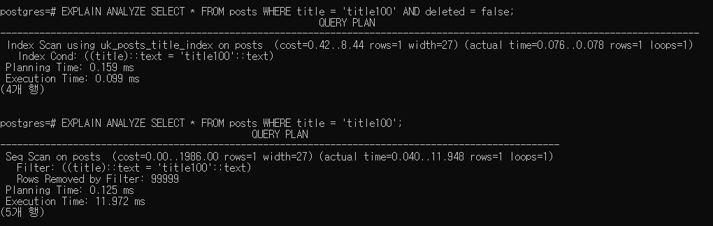

# JPA + Hibernate 기반의 개발 환경에서 Soft Delete 구현하기

## Soft Delete란?

Soft Delete 또는 Logical Delete는 delete 쿼리를 사용하여 물리적으로 데이터를 삭제하는 것이 아니라
update 쿼리를 통해 상태를 변경하여 삭제된 데이터로 구분할 수 있도록 논리적으로 데이터를 삭제하는 것을 의미합니다.

삭제된 데이터로 구분할 수 있는 방법은 다음과 같습니다.
- delete_flag(boolean, int) 컬럼의 값이 true 또는 1인 경우
- delete_at(timestamp) 컬럼의 값이 현재 timestamp보다 이전인 경우

Soft Delete는 물리적인 데이터 삭제가 부담되거나 삭제된 데이터들을 보관하여 데이터로써 활용할 필요나 가치가 있는 경우에 사용됩니다.

## Soft Delete & Hard Delete 비교

Soft Delete와 Hard Delete를 사용했을 때 여러가지 관점에서 비교를 해보겠습니다.

| |Soft Delete|Hard Delete|comment|
|---|-----|-----|-----|
|삭제|UPDATE table SET delete_flag = true WHERE id = ?|DELETE table FROM WHERE id = ?|Soft Delete는 삭제 구분 값을 수정하여 논리적으로 데이터를 삭제 처리합니다.|
|조회|SELECT * FROM table WHERE delete_flag = false|SELECT * FROM table|Soft Delete는 삭제 처리된 데이터가 포함되어 존재하기 때문에 모든 조회 쿼리에 delete_flag = false 조건이 필요합니다.|
|복원|update 쿼리로 삭제 구분 값을 변경하여 복원합니다.|백업 또는 쿼리 로그를 통해 복원합니다.|Hard Delete는 백업과 장애 발생 시점의 간격과 쿼리 로그 유무에 따라 복원이 어려울 수 있습니다.|
|용량|삭제시 테이블의 용량이 감소하지 않습니다.|삭제시 테이블의 용량이 감소합니다.|Soft Delete는 데이터가 물리적으로 삭제되지 않기 때문에 지속적으로 테이블의 용량이 증가합니다.|
|unique index|삭제 처리된 값을 필터링 할 수 있는 partial index를 사용하여 unique index를 생성합니다. 만약 지원하지 않는 DBMS를 사용하는 경우 삭제된 데이터와 값이 중복되어 unique 제약조건을 위반할 수 있으므로 삭제 구분 컬럼으로 delete_at(timestamp)을 사용하고 index 구성에 포함시킵니다.|중복될 수 없는 값들로 unique index를 구성합니다.|Sofe Delete는 partial index를 사용할 수 없는 경우 삭제 처리된 데이터가 인덱스에 포함됩니다.
|on delete cascade|삭제 구분 값을 수정하여 삭제 처리하기 때문에 발생하지 않습니다. 애플리케이션에서 쿼리를 발생시켜 참조 테이블을 삭제 처리하거나 데이터베이스의 트리거를 사용해야합니다.|삭제시 설정된 cascade가 발생합니다.|Soft Delete는 삭제 처리시 발생하는 cascade를 직접 구현해야합니다.|

TODO 더 설명할 필요가 있는 내용 추가

## JPA + Hibernate 개발 환경에서의 구현

Spring Boot 기반의 웹 애플리케이션을 Hibernate를 사용해서 개발할 때 soft delete를 구현하는 방법과 주의해야할 점에 대해서 알아보겠습니다.

개발 환경 정보
- Spring Boot 2.5.10
- Hibernate 5.4.33
- Postgresql 14.1

### 구현

```java
@Entity
@Where(clause = "deleted = false")
@SQLDelete(sql = "UPDATE posts SET deleted = true WHERE id = ?")
@Getter
@NoArgsConstructor(access = AccessLevel.PROTECTED)
public class Posts {

    @Id
    @GeneratedValue(strategy = GenerationType.IDENTITY)
    private Long id;

    @Column(nullable = false)
    private String title;

    @Column(nullable = false)
    private String content;

    @Column(nullable = false)
    private boolean deleted;

    @OneToMany(fetch = FetchType.LAZY, mappedBy = "post", cascade = CascadeType.REMOVE)
    private List<Comments> comments = new ArrayList<>();

    public Posts(String title, String content) {
        this.title = title;
        this.content = content;
    }

    public void delete() {
        this.deleted = true;
    }

    public void addComment(Comments comment) {
        this.comments.add(comment);
    }

}
```

```java
@Entity
@Where(clause = "deleted = false")
@SQLDelete(sql = "UPDATE comments SET deleted = true WHERE id = ?")
@Getter
@NoArgsConstructor(access = AccessLevel.PROTECTED)
public class Comments {

    @Id
    @GeneratedValue(strategy = GenerationType.IDENTITY)
    private Long id;

    @Column(nullable = false)
    private String content;

    @ManyToOne(fetch = FetchType.LAZY, optional = false)
    private Posts post;

    @Column(nullable = false)
    private boolean deleted;

    public Comments(String content, Posts post) {
        this.content = content;
        this.post = post;
        this.post.addComment(this);
    }

    public void delete() {
        this.deleted = true;
    }
```

```roomsql
CREATE UNIQUE INDEX UK_POSTS_TITLE_INDEX ON posts(title) WHERE deleted = false; -- postgresql
```

예제 소스 코드에서 사용할 게시글과 댓글 엔티티 클래스입니다. soft delete를 구현하기 위해 boolean타입의 deleted 필드로 삭제 유무를 구분하고 delete 메소드를 통해 객체의 상태를 변경하여 삭제합니다.
사용하고 있는 DBMS가 partial index를 지원하는 경우 삭제된 데이터를 인덱스에서 필터링하여 사용합니다.

@Where 애노테이션이 지정된 엔티티를 조회할 때 쿼리의 where절에 반드시 포함되는 조건을 설정할 수 있습니다. 삭제 구분 컬럼은 sofe delete에서 
삭제된 데이터를 제외하기 위해서 반드시 포함되어야하지만 개발자가 실수로 조건절에서 누락할 수 있기 때문에 애노테이션을 통해 글로벌하게 설정하는 것이 좋습니다. 또한 연관관계 엔티티의 패치 타입 전략을 Lazy하게 가져가는 경우
Lazy Loading으로 발생하는 조회 쿼리의 조건절에도 포함시키기 위해서는 반드시 사용해야합니다. 하지만 JPQL 또는 HQL이 아닌 Native SQL을 사용할 때는 적용되지 않기 때문에 주의해야합니다. 

@SQLDelete 애노테이션이 지정된 엔티티의 상태를 removed로 변경할 때 발생하는 쿼리를 설정할 수 있습니다. soft delete는 delete 쿼리가 발생하지 않기 때문에
on delete cascade를 사용할 수 없지만 @SQLDelete와 cascade 옵션을 함께 사용하면 soft delete에서 cascade를 별도의 데이터베이스 트리거나 소스 코드 없이도 쉽게 구현할 수 있습니다.

### 테스트

```java
@Test
void softDelete() {
    // given
    Posts post = new Posts("[FAAI] 공지사항", "오늘은 다들 일하지 말고 집에 가세요!");
    Comments comment = new Comments("우와아~ 집에 갑시다.", post);
    Comments comment2 = new Comments("노트북 가져가도 되나요?", post);

    // when
    entityManager.persist(post);
    entityManager.persist(comment);
    entityManager.persist(comment2);
    entityManager.flush();
    post.delete();
    comment.delete();
    comment2.delete();
    entityManager.flush();
    entityManager.clear();

    // then
    assertNull(entityManager.find(Posts.class, post.getId()));
    assertNull(entityManager.find(Comments.class, comment.getId()));
    assertNull(entityManager.find(Comments.class, comment2.getId()));
}
```

```text
2022-02-10 20:52:47.414 DEBUG 7184 --- [    Test worker] org.hibernate.SQL                        : 
    update
        posts 
    set
        content=?,
        deleted=?,
        title=? 
    where
        id=?
2022-02-10 20:52:47.415 TRACE 7184 --- [    Test worker] o.h.type.descriptor.sql.BasicBinder      : binding parameter [1] as [VARCHAR] - [오늘은 다들 일하지 말고 집에 가세요!]
2022-02-10 20:52:47.415 TRACE 7184 --- [    Test worker] o.h.type.descriptor.sql.BasicBinder      : binding parameter [2] as [BOOLEAN] - [true]
2022-02-10 20:52:47.416 TRACE 7184 --- [    Test worker] o.h.type.descriptor.sql.BasicBinder      : binding parameter [3] as [VARCHAR] - [[FAAI] 공지사항]
2022-02-10 20:52:47.416 TRACE 7184 --- [    Test worker] o.h.type.descriptor.sql.BasicBinder      : binding parameter [4] as [BIGINT] - [1]
2022-02-10 20:52:47.419 DEBUG 7184 --- [    Test worker] org.hibernate.SQL                        : 
    update
        comments 
    set
        content=?,
        deleted=?,
        post_id=? 
    where
        id=?
2022-02-10 20:52:47.420 TRACE 7184 --- [    Test worker] o.h.type.descriptor.sql.BasicBinder      : binding parameter [1] as [VARCHAR] - [우와아~ 집에 갑시다.]
2022-02-10 20:52:47.421 TRACE 7184 --- [    Test worker] o.h.type.descriptor.sql.BasicBinder      : binding parameter [2] as [BOOLEAN] - [true]
2022-02-10 20:52:47.421 TRACE 7184 --- [    Test worker] o.h.type.descriptor.sql.BasicBinder      : binding parameter [3] as [BIGINT] - [1]
2022-02-10 20:52:47.421 TRACE 7184 --- [    Test worker] o.h.type.descriptor.sql.BasicBinder      : binding parameter [4] as [BIGINT] - [1]
2022-02-10 20:52:47.422 DEBUG 7184 --- [    Test worker] org.hibernate.SQL                        : 
    update
        comments 
    set
        content=?,
        deleted=?,
        post_id=? 
    where
        id=?
2022-02-10 20:52:47.423 TRACE 7184 --- [    Test worker] o.h.type.descriptor.sql.BasicBinder      : binding parameter [1] as [VARCHAR] - [노트북 가져가도 되나요?]
2022-02-10 20:52:47.424 TRACE 7184 --- [    Test worker] o.h.type.descriptor.sql.BasicBinder      : binding parameter [2] as [BOOLEAN] - [true]
2022-02-10 20:52:47.424 TRACE 7184 --- [    Test worker] o.h.type.descriptor.sql.BasicBinder      : binding parameter [3] as [BIGINT] - [1]
2022-02-10 20:52:47.424 TRACE 7184 --- [    Test worker] o.h.type.descriptor.sql.BasicBinder      : binding parameter [4] as [BIGINT] - [2]
2022-02-10 20:52:47.439 DEBUG 7184 --- [    Test worker] org.hibernate.SQL                        : 
    select
        posts0_.id as id1_1_0_,
        posts0_.content as content2_1_0_,
        posts0_.deleted as deleted3_1_0_,
        posts0_.title as title4_1_0_ 
    from
        posts posts0_ 
    where
        posts0_.id=? 
        and (
            posts0_.deleted = false
        )
2022-02-10 20:52:47.441 TRACE 7184 --- [    Test worker] o.h.type.descriptor.sql.BasicBinder      : binding parameter [1] as [BIGINT] - [1]
2022-02-10 20:52:47.452 DEBUG 7184 --- [    Test worker] org.hibernate.SQL                        : 
    select
        comments0_.id as id1_0_0_,
        comments0_.content as content2_0_0_,
        comments0_.deleted as deleted3_0_0_,
        comments0_.post_id as post_id4_0_0_ 
    from
        comments comments0_ 
    where
        comments0_.id=? 
        and (
            comments0_.deleted = false
        )
2022-02-10 20:52:47.453 TRACE 7184 --- [    Test worker] o.h.type.descriptor.sql.BasicBinder      : binding parameter [1] as [BIGINT] - [1]
2022-02-10 20:52:47.455 DEBUG 7184 --- [    Test worker] org.hibernate.SQL                        : 
    select
        comments0_.id as id1_0_0_,
        comments0_.content as content2_0_0_,
        comments0_.deleted as deleted3_0_0_,
        comments0_.post_id as post_id4_0_0_ 
    from
        comments comments0_ 
    where
        comments0_.id=? 
        and (
            comments0_.deleted = false
        )
2022-02-10 20:52:47.456 TRACE 7184 --- [    Test worker] o.h.type.descriptor.sql.BasicBinder      : binding parameter [1] as [BIGINT] - [2]
```

엔티티를 조회하는 select 쿼리에 delete = false 조건이 where절에 포함되어 삭제된 데이터를 제외하는 것을 확인할 수 있습니다.

```java
@Test
void softDeleteCascade() {
    // given
    Posts post = new Posts("[FAAI] 공지사항", "오늘은 다들 일하지 말고 집에 가세요!");
    Comments comment = new Comments("우와아~ 집에 갑시다.", post);
    Comments comment2 = new Comments("노트북 가져가도 되나요?", post);

    // when
    entityManager.persist(post);
    entityManager.persist(comment);
    entityManager.persist(comment2);
    entityManager.flush();
    entityManager.remove(post); // on soft delete cascade
    entityManager.flush();

    // then
    assertNull(entityManager.find(Posts.class, post.getId()));
    assertNull(entityManager.find(Comments.class, comment.getId()));
    assertNull(entityManager.find(Comments.class, comment2.getId()));
}
```

```text
2022-02-10 21:04:43.517 DEBUG 14864 --- [    Test worker] org.hibernate.SQL                        : 
    UPDATE
        comments 
    SET
        deleted = true 
    WHERE
        id = ?
2022-02-10 21:04:43.518 TRACE 14864 --- [    Test worker] o.h.type.descriptor.sql.BasicBinder      : binding parameter [1] as [BIGINT] - [1]
2022-02-10 21:04:43.522 DEBUG 14864 --- [    Test worker] org.hibernate.SQL                        : 
    UPDATE
        comments 
    SET
        deleted = true 
    WHERE
        id = ?
2022-02-10 21:04:43.523 TRACE 14864 --- [    Test worker] o.h.type.descriptor.sql.BasicBinder      : binding parameter [1] as [BIGINT] - [2]
2022-02-10 21:04:43.524 DEBUG 14864 --- [    Test worker] org.hibernate.SQL                        : 
    UPDATE
        posts 
    SET
        deleted = true 
    WHERE
        id = ?
2022-02-10 21:04:43.525 TRACE 14864 --- [    Test worker] o.h.type.descriptor.sql.BasicBinder      : binding parameter [1] as [BIGINT] - [1]
2022-02-10 21:04:43.534 DEBUG 14864 --- [    Test worker] org.hibernate.SQL                        : 
    select
        posts0_.id as id1_1_0_,
        posts0_.content as content2_1_0_,
        posts0_.deleted as deleted3_1_0_,
        posts0_.title as title4_1_0_ 
    from
        posts posts0_ 
    where
        posts0_.id=? 
        and (
            posts0_.deleted = false
        )
2022-02-10 21:04:43.536 TRACE 14864 --- [    Test worker] o.h.type.descriptor.sql.BasicBinder      : binding parameter [1] as [BIGINT] - [1]
2022-02-10 21:04:43.546 DEBUG 14864 --- [    Test worker] org.hibernate.SQL                        : 
    select
        comments0_.id as id1_0_0_,
        comments0_.content as content2_0_0_,
        comments0_.deleted as deleted3_0_0_,
        comments0_.post_id as post_id4_0_0_ 
    from
        comments comments0_ 
    where
        comments0_.id=? 
        and (
            comments0_.deleted = false
        )
2022-02-10 21:04:43.547 TRACE 14864 --- [    Test worker] o.h.type.descriptor.sql.BasicBinder      : binding parameter [1] as [BIGINT] - [1]
2022-02-10 21:04:43.548 DEBUG 14864 --- [    Test worker] org.hibernate.SQL                        : 
    select
        comments0_.id as id1_0_0_,
        comments0_.content as content2_0_0_,
        comments0_.deleted as deleted3_0_0_,
        comments0_.post_id as post_id4_0_0_ 
    from
        comments comments0_ 
    where
        comments0_.id=? 
        and (
            comments0_.deleted = false
        )
2022-02-10 21:04:43.549 TRACE 14864 --- [    Test worker] o.h.type.descriptor.sql.BasicBinder      : binding parameter [1] as [BIGINT] - [2]
```

엔티티의 상태를 removed로 변경하여 cascade remove 옵션이 적용된 연관관계 엔티티를 대상으로 @SQLDelete 애노테이션에 설정된 쿼리를 발생시켜 모두 삭제합니다.

```java
@Test
    void softDeleteUniqueConstraint() {
    // given
    String sameTitle = "[FAAI] 공지사항";
    Posts post = new Posts(sameTitle, "오늘은 다들 일하지 말고 집에 가세요!");
    Posts post2 = new Posts(sameTitle, "오늘은 다들 일하지 말고 집에 가세요!");
    Posts post3 = new Posts(sameTitle, "오늘은 다들 일하지 말고 집에 가세요!");

    // when
    entityManager.persist(post);
    entityManager.flush();
    post.delete();
    entityManager.flush();
    entityManager.persist(post2);

    // then
    PersistenceException exception = assertThrows(
        PersistenceException.class,
        () -> {
            entityManager.flush();
            entityManager.persist(post3);
        }
    );
    assertEquals(ConstraintViolationException.class, exception.getCause().getClass());
}
```

```text
2022-02-10 22:16:58.626 DEBUG 12820 --- [    Test worker] org.hibernate.SQL                        : 
    insert 
    into
        posts
        (content, deleted, title) 
    values
        (?, ?, ?)
2022-02-10 22:16:58.632 TRACE 12820 --- [    Test worker] o.h.type.descriptor.sql.BasicBinder      : binding parameter [1] as [VARCHAR] - [오늘은 다들 일하지 말고 집에 가세요!]
2022-02-10 22:16:58.634 TRACE 12820 --- [    Test worker] o.h.type.descriptor.sql.BasicBinder      : binding parameter [2] as [BOOLEAN] - [false]
2022-02-10 22:16:58.634 TRACE 12820 --- [    Test worker] o.h.type.descriptor.sql.BasicBinder      : binding parameter [3] as [VARCHAR] - [[FAAI] 공지사항]
2022-02-10 22:16:58.662 DEBUG 12820 --- [    Test worker] org.hibernate.SQL                        : 
    update
        posts 
    set
        content=?,
        deleted=?,
        title=? 
    where
        id=?
2022-02-10 22:16:58.663 TRACE 12820 --- [    Test worker] o.h.type.descriptor.sql.BasicBinder      : binding parameter [1] as [VARCHAR] - [오늘은 다들 일하지 말고 집에 가세요!]
2022-02-10 22:16:58.668 TRACE 12820 --- [    Test worker] o.h.type.descriptor.sql.BasicBinder      : binding parameter [2] as [BOOLEAN] - [true]
2022-02-10 22:16:58.668 TRACE 12820 --- [    Test worker] o.h.type.descriptor.sql.BasicBinder      : binding parameter [3] as [VARCHAR] - [[FAAI] 공지사항]
2022-02-10 22:16:58.670 TRACE 12820 --- [    Test worker] o.h.type.descriptor.sql.BasicBinder      : binding parameter [4] as [BIGINT] - [9]
2022-02-10 22:16:58.675 DEBUG 12820 --- [    Test worker] org.hibernate.SQL                        : 
    insert 
    into
        posts
        (content, deleted, title) 
    values
        (?, ?, ?)
2022-02-10 22:16:58.676 TRACE 12820 --- [    Test worker] o.h.type.descriptor.sql.BasicBinder      : binding parameter [1] as [VARCHAR] - [오늘은 다들 일하지 말고 집에 가세요!]
2022-02-10 22:16:58.676 TRACE 12820 --- [    Test worker] o.h.type.descriptor.sql.BasicBinder      : binding parameter [2] as [BOOLEAN] - [false]
2022-02-10 22:16:58.676 TRACE 12820 --- [    Test worker] o.h.type.descriptor.sql.BasicBinder      : binding parameter [3] as [VARCHAR] - [[FAAI] 공지사항]
2022-02-10 22:16:58.682 DEBUG 12820 --- [    Test worker] org.hibernate.SQL                        : 
    insert 
    into
        posts
        (content, deleted, title) 
    values
        (?, ?, ?)
2022-02-10 22:16:58.682 TRACE 12820 --- [    Test worker] o.h.type.descriptor.sql.BasicBinder      : binding parameter [1] as [VARCHAR] - [오늘은 다들 일하지 말고 집에 가세요!]
2022-02-10 22:16:58.683 TRACE 12820 --- [    Test worker] o.h.type.descriptor.sql.BasicBinder      : binding parameter [2] as [BOOLEAN] - [false]
2022-02-10 22:16:58.683 TRACE 12820 --- [    Test worker] o.h.type.descriptor.sql.BasicBinder      : binding parameter [3] as [VARCHAR] - [[FAAI] 공지사항]
2022-02-10 22:16:58.689  WARN 12820 --- [    Test worker] o.h.engine.jdbc.spi.SqlExceptionHelper   : SQL Error: 0, SQLState: 23505
2022-02-10 22:16:58.689 ERROR 12820 --- [    Test worker] o.h.engine.jdbc.spi.SqlExceptionHelper   : 오류: 중복된 키 값이 "uk_posts_title_index" 고유 제약 조건을 위반함
  Detail: (title)=([FAAI] 공지사항) 키가 이미 있습니다.
2022-02-10 22:16:58.707  INFO 12820 --- [    Test worker] o.s.t.c.transaction.TransactionContext   : Rolled back transaction for test: [DefaultTestContext@3f2ef586 testClass = ExampleApplicationTests, testInstance = me.sinbom.example.ExampleApplicationTests@5b29d699, testMethod = softDeleteUniqueIndex@ExampleApplicationTests, testException = [null], mergedContextConfiguration = [WebMergedContextConfiguration@751d3241 testClass = ExampleApplicationTests, locations = '{}', classes = '{class me.sinbom.example.ExampleApplication}', contextInitializerClasses = '[]', activeProfiles = '{test}', propertySourceLocations = '{}', propertySourceProperties = '{org.springframework.boot.test.context.SpringBootTestContextBootstrapper=true}', contextCustomizers = set[org.springframework.boot.test.autoconfigure.actuate.metrics.MetricsExportContextCustomizerFactory$DisableMetricExportContextCustomizer@6f3c660a, org.springframework.boot.test.autoconfigure.properties.PropertyMappingContextCustomizer@0, org.springframework.boot.test.autoconfigure.web.servlet.WebDriverContextCustomizerFactory$Customizer@74bada02, org.springframework.boot.test.context.filter.ExcludeFilterContextCustomizer@6ad3381f, org.springframework.boot.test.json.DuplicateJsonObjectContextCustomizerFactory$DuplicateJsonObjectContextCustomizer@34a875b3, org.springframework.boot.test.mock.mockito.MockitoContextCustomizer@0, org.springframework.boot.test.web.client.TestRestTemplateContextCustomizer@4f1bfe23, org.springframework.boot.test.context.SpringBootTestArgs@1, org.springframework.boot.test.context.SpringBootTestWebEnvironment@6babf3bf], resourceBasePath = 'src/main/webapp', contextLoader = 'org.springframework.boot.test.context.SpringBootContextLoader', parent = [null]], attributes = map['org.springframework.test.context.web.ServletTestExecutionListener.activateListener' -> true, 'org.springframework.test.context.web.ServletTestExecutionListener.populatedRequestContextHolder' -> true, 'org.springframework.test.context.web.ServletTestExecutionListener.resetRequestContextHolder' -> true, 'org.springframework.test.context.event.ApplicationEventsTestExecutionListener.recordApplicationEvents' -> false]]

```

post가 delete 쿼리를 통해 삭제되지 않아 실제로 동일한 title 컬럼의 데이터가 존재하지만 partial index에서 필터링되어 unique constraint를 위반하지 않습니다.
반면 post2가 삭제되지 않은 상태에서 post3를 insert하게 되면 constraint 위반 에러가 발생합니다.



100000개의 데이터가 존재하는 posts 테이블을 대상으로 조회한 실행계획입니다. 조건절에 deleted = false가 없는 쿼리는 인덱스가 적용되지 않습니다.
앞서 구현한 방식대로 hibernate 환경에서 soft delete를 사용한다면 모든 조회 쿼리에 deleted = false가 포함되어 unique index가 잘 적용된다는 것을 알 수 있습니다.


### 발생할 수 있는 문제점
### 해결방안
#### @NotFound With Eager Fetch Join
#### Locking(애플리케이션 락, 분산 락, 데이터베이스 락)


## 마무리

TODO 반드시 Soft Delete를 사용하는 것보다는 상황과 필요에 따라 Soft Delete를 사용하는 것이 좋다는 내용.